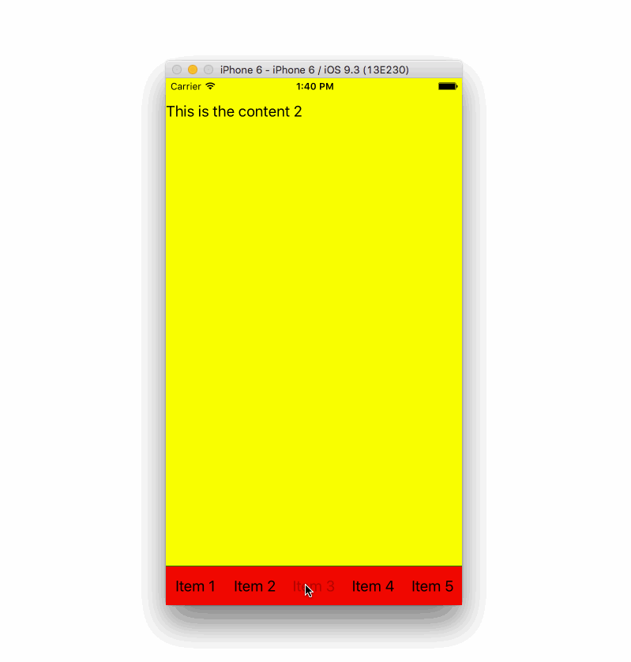

## react-native-tabbar

React-Native Tab bar with more freedom

### Introduction

I have decided to remove all the abstraction from this module. Now there is only
one component, and that is `Tabbar`. All the children inside `Tabbar` component will
be rendered inside of it. There are no `TabItem`, `WithIcon` or anything else. what you put into `Tabbar` will be displayed as tabs. By doing that, you can attach it to your
favourite state managements such as `Redux`, or `Mobx`. This module should be use as a first base block for more sophisticated tabbar. Please take a look at examples folder as I added couple of common usage.

### Installation

```bash
npm install react-native-tabbar
```

### Methods

| name | arguments | description |
|----|----|
| hide | duration | shows the tabbar with animations, default duration is 200 ms |
| show | duration | shows the tabbar with animations, default duration is 200 ms |
| updateHeight | scrollY position | pass the value of onScroll y position to show or hide tabbar |
| recalculate | none | once your orientation changes, call this method to re calculate the correct position of tabbar |

### Props

| name | type | default value | description |
|----|----|----|----|
| height | number | 50 | the height of tabbar |
| offset | number | 150 | how far you have to scroll before tabbar starts to disappear |
| step | number | 0.25 | the lower the number the slower the tabbar disappear |
| show | boolean | true | if you want to not show the tabbar at the start, pass false to this prop |
| disable | boolean | false | disables the progress show/hide tabbar |

### examples

- Tabbar changes based on Orientation

